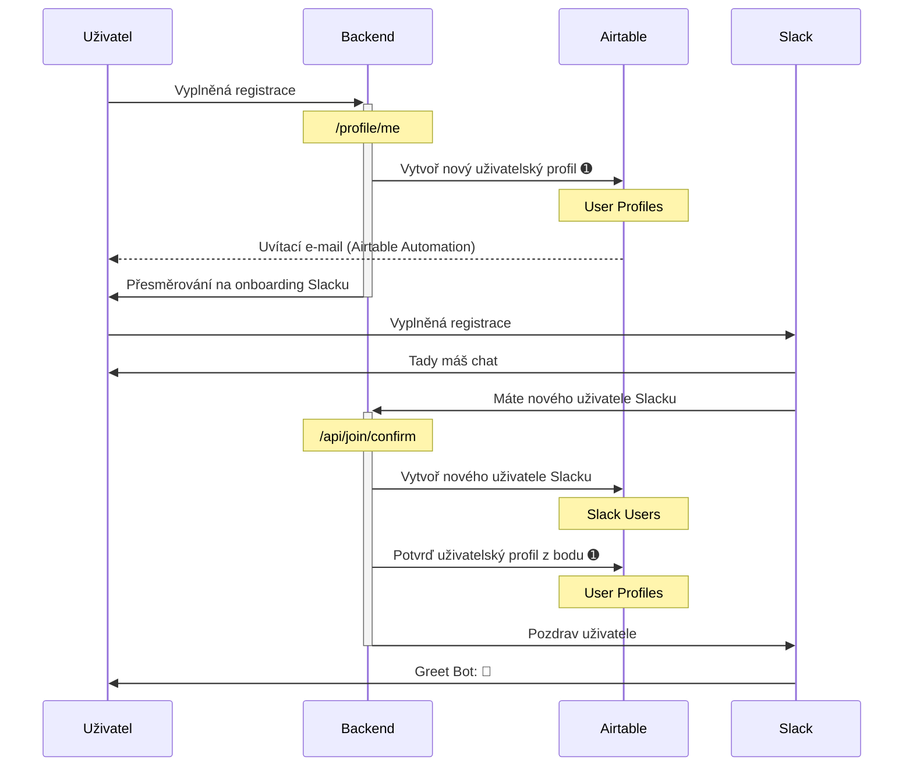

# Uživatelské účty

Základní data o uživatelích máme rozdělená do dvou propojených tabulek: Tabulka _User Profiles_ obsahuje data přímo spravovaná uživatelem (například seznam jeho kompetencí), tabulka _Slack Users_ obsahuje data získaná ze Slacku (například profilový obrázek).

## Založení účtu

1. Uživatel vyplní onboardovací formulář na adrese join.cesko.digital, kde zadá základní údaje, zejména e-mail. Po odeslání uložíme do tabulky _User Profiles_ nový uživatelský profil ve stavu `unconfirmed`. (TBD: Co když už daný e-mail v databázi je?)
2. Po odeslání formuláře je uživatel přesměrován na onboarding Slacku, kde mimo jiné opět zadává mailovou adresu a Slack ji ověřuje.
3. Po úspěšném přihlášení do Slacku zavolá server Slacku automaticky náš API endpoint `/api/join/confirm` a předá ID nově přihlášeného uživatele. My uložíme do tabulky _Slack Users_ informaci o novém uživateli, podle jeho e-mailu najdeme odpovídající doposud nepotvrzený uživatelský profil v tabulce _User Profiles_, označíme jej za `confirmed` a provážeme ho s odpovídajícím řádkem tabulky _Slack Users_.

## E-maily

U každého uživatele vedeme v principu až tři e-mailové adresy:

- _Registrační e-mail_ vyplní uživatel v onboardovacím formuláři (join.cesko.digital).
  V databázi jde o pole `email` v tabulce `User Profiles`.
- Následně uživatel během onboardingu do Slacku vyplní druhý e-mail, říkejme mu třeba
  _slackový_. V ideálním případě je stejný jako ten předchozí, ale v reálu uživatelé běžně
  zadávají jiný (například ten, na který už mají zřízený jiný slackový účet).
  V databázi jde o pole `email` v tabulce `Slack Users`.
- Třetí email jde vyplnit v profilu Slacku, říkejme mu třeba _kontaktní_. V databázi ukládáme
  do pole `contactEmail` v tabulce `Slack Users` (které pro pohodlí zobrazujeme i v tabulce `User Profiles`).

Poznámky k využití jednotlivých adres:

- Obecně pracujeme s prvními dvěma adresami jako neveřejnými a teprve ta třetí je určená
  pro běžné zobrazení.
- Historicky jsme měli nejdřív pouze registrační e-maily ze Slacku, a právě ty jsme proto
  synchronizovali do Ecomailu, abychom členům komunity mohli rozesílat newsletter. Zhruba od
  začátku roku 2023 se už ale uživatelé přihlašují do Ecomailu sami prostřednictvím formuláře
  (viz https://cesko.digital/go/newsletters), kde můžou vyplnit libovolný e-mail.
- Pokud se uživatel přihlašuje přes Slack k našemu webu, součástí JWT tokenu, který přihlášením
  vznikne, je jeho slackový mail.
- Přímo měnit může uživatel svůj slackový mail ([viz tady](https://slack.com/help/articles/207262907-Change-your-email-address))
  a kontaktní mail (v profilu na Slacku).
- Ověřený je pouze slackový mail, náš registrační mail ani kontaktní mail ze slackového profilu
  zatím neověřujeme.