# Stavy projektů

## Draft

Náhledová verze, není určena pro běžné návštěvníky, ale pouze pro editory, aby si mohli odladit data před vydáním. Jakákoliv data spojená s projektem v tomto stavu (například eventy nebo příležitosti) se berou též jako náhledová a neveřejná.

**TODO**: Aktuálně a přechodně implementujeme draft projekty tak, že je nezobrazujeme v přehledu projektů, ale zobrazujeme příležitosti a další data s nimi spjatá (ze kterých ale nesmí jít prokliknout na detail projektu).

## Internal

Interní projekt Česko.Digital, například Příručka Česko.Digital nebo č.edu. Tyto projekty chceme zobrazovat v přehledu projektů nebo odlišným způsobem, jinak se chovají úplně stejně jako projekty ve stavu `running`.

**TODO**: Aktuálně a přechodně implementujeme stav `internal` stejně jako `draft`, tedy projekty nezobrazujeme v přehledu, ale zobrazujeme příležitosti a další data s nimi spjatá (ze kterých ale nesmí jít prokliknout na detail projektu).

## Incubating

Projekt běží a je v inkubační neboli _pre-product_ fázi. Hledáme správné zadání, cílovku, etc. Na webu zobrazujeme všude, ale můžeme využít odlišnou prezentaci, aby návštěvník projekt rozeznal od projektů v realizační fázi.

Pro skončení inkubace projekt může přejít do stavu `running` (realizační fáze) nebo `finished` (skončil v Česko.Digital a může například hledat realizační tým jinde).

## Running

Projekt běží a je v realizační fázi. (Před kterou mohl a nemusel projít inkubační fází v Česko.Digital.) Na webu zobrazujeme všude.

## Finished

Projekt byl „dokončen“. Neznamená to, že zavřel krám – projekty, které se u nás inkubovaly, mohou přikročit k realizaci, a projekty, které u nás byly v realizační fázi, mohou po dokončení například hledat další rozvoj nebo údržbu jinde.

# Proměnné prostředí

Pokud potřebujete nějakou hodnotu nastavit během vývoje, můžete ji uložit do souboru `.env.local`, Next.js si ji sám načte.

- `AIRTABLE_API_KEY` je klíč k Airtable
- `ECOMAIL_API_KEY` je klíč k Ecomailu, používáme ho pro registraci nových zájemců o newsletter
- `SLACK_CLIENT_ID` a `SLACK_CLIENT_SECRET` slouží pro přihlašování uživatelů přes funkci _Sign in With Slack_
- `NEXTAUTH_URL` je URL, na které se má přesměrovat OAuth flow při přihlašování k webu
- `NEXTAUTH_SECRET` je tajemství používané pro podepisování sessions

# Uživatelské účty

Základní data o uživatelích máme rozdělená do dvou propojených tabulek: Tabulka _User Profiles_ obsahuje data přímo spravovaná uživatelem (například seznam jeho kompetencí), tabulka _Slack Users_ obsahuje data získaná ze Slacku (například profilový obrázek).

## Založení účtu

1. Uživatel vyplní onboardovací formulář na adrese join.cesko.digital, kde zadá základní údaje, zejména e-mail. Po odeslání uložíme do tabulky _User Profiles_ nový uživatelský profil ve stavu `unconfirmed`. (TBD: Co když už daný e-mail v databázi je?)
2. Po odeslání formuláře je uživatel přesměrován na onboarding Slacku, kde mimo jiné opět zadává mailovou adresu a Slack ji ověřuje.
3. Po úspěšném přihlášení do Slacku zavolá server Slacku automaticky náš API endpoint `/api/slack_events/team_join` a předá ID nově přihlášeného uživatele. My uložíme do tabulky _Slack Users_ informaci o novém uživateli, podle jeho e-mailu najdeme odpovídající doposud nepotvrzený uživatelský profil v tabulce _User Profiles_, označíme jej za `confirmed` a provážeme ho s odpovídajícím řádkem tabulky _Slack Users_.

```mermaid
sequenceDiagram
    participant Uživatel
    participant Backend
    participant Airtable
    participant Slack
    Uživatel->>+Backend: Vyplněná registrace
    Note over Backend: /api/user_profiles
    Backend->>Airtable: Vytvoř nový uživatelský profil ➊
    Note over Airtable: User Profiles
    Airtable-->>Uživatel: Uvítací e-mail (Airtable Automation)
    Backend->>-Uživatel: Přesměrování na onboarding Slacku
    Uživatel->>Slack: Vyplněná registrace
    Slack->>Uživatel: Tady máš chat
    Slack->>+Backend: Máte nového uživatele Slacku
    Note over Backend: /api/slack_events/team_join
    Backend->>Airtable: Vytvoř nového uživatele Slacku
    Note over Airtable: Slack Users
    Backend->>Airtable: Potvrď uživatelský profil z bodu ➊
    Note over Airtable: User Profiles
    Backend->>-Slack: Pozdrav uživatele
    Slack->>Uživatel: Greet Bot: 👋
```

