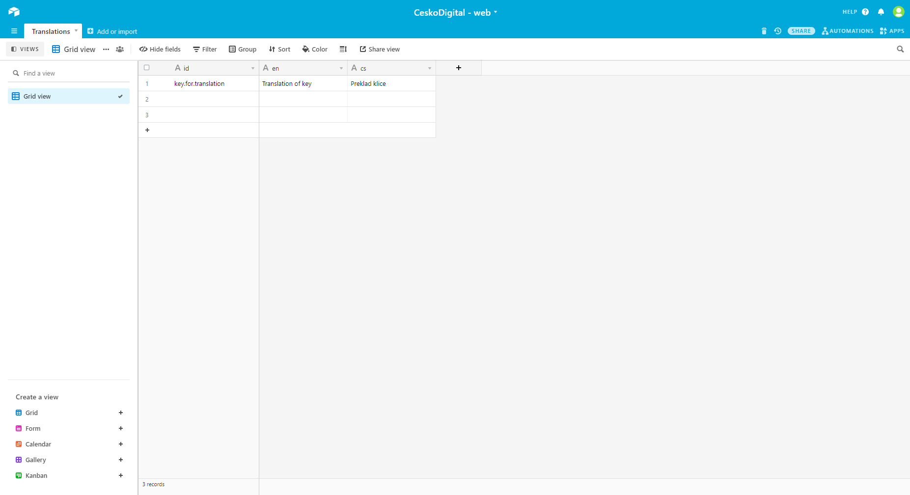

# Translations

Překlady jsou realizovány pomocí `gatsby-plugin-react-i18next` ve spojení se Airtable. Airtable umožnuje vytvářet tabulky a databáze, ze kterých jsou překlady staženy pomocí skriptu `yarn translations:get`. Tento skript spustí `scripts/get-translations.ts`. V rámci tohoto skriptu je vytvořeno připojení do Airtable, staženy záznamy a vytvořeny JSON soubory ve složce `locale/`. Následně je spuštěno `gatsby clean` pro vyčištění cache.

V rámci aplikace lze tyto překlady použit pomocí `useTranslation` takto:

```
import { useTranslation } from 'gatsby-plugin-react-i18next'
const { t } = useTranslation()
t('key.for.translation')
```

Namespace je defaultně "translation" díky tomu, že všechny překlady jsou realizovány v rámci jednoho souboru.

Pro spuštění skriptu a načtení překladů je nutné mít dostupné environment proměné. Jmenovitě:

- AIRTABLE_TRANSLATION_KEY
- AIRTABLE_TRANSLATION_BASE
- AIRTABLE_TRANSLATION_VIEW (defaultně "Grid view")
- AIRTABLE_TRANSLATION_BASE_NAME (defaultně "Translations")

## Přidání jazyka

Pro přidání jazyka je ve službe Airtable definovat nový sloupec, který bude identifikovat překlady pro daný jazyk. Následně v `scripts/get-translations` a `AirTableColumn` je nutné definovat nový klíč. V rámci `AirtableStructure` potom definovat tento klíč jako string. Dále ve funkci `splitByLanguages` je nutné přidat mapování pro tento nový jazyk.

Pozor na to, že název sloupce musí odpovídat nastavení v `gatsby-config.js` u pluginu `gatsby-plugin-react-i18next` v rámci `languages`.

## Přidání překladu

Pro přídání překladu je nutné ve službě Airtable přidat nový záznam s hodnotou `key` a překlady pro dané jazyky. Názvy sloupců pro dané jazyky je možné definovat v `scripts/get-translations` a `AirTableColumn`.

## Airtable configuration

Pro nastavení nové překladové databáze budeme postupovat následovně.

- Vytvoříme nový nebo použijeme existující workspace.
- Vytvoříme novou tabulku "Create empty table".
- Tabulce dáme název, který následně použijeme v `AIRTABLE_TRANSLATION_BASE_NAME` pro jednoduché nastavení pojmenute tabulku "Translations".
- Smaženeme všechny předvytvořené sloupce a vytvoříme nové takto:
  - id = sloupec určující klíč (typ: "single line text")
  - en = sloupec s p5eklady angličtiny (typ: "single line text")
  - cs = sloupec s překlady češtiny (typ: "single line text")
  - a případně další sloupce pro překlady dalších jazyků ...
- Ujistíme se, že existuje tabulkový pohled "Grid view". Můžeme použit vlastní název, který speficikujeme v `AIRTABLE_TRANSLATION_VIEW`.

Poté co je nastavená datová vrstva potřebujeme získat přístupové klíče. Ty získáme v nastavení účtu a specifikujeme v rámci `AIRTABLE_TRANSLATION_KEY`.

Posledním krokem je specifikace workspace, klíč jednodušše získáme přes airtable.com/api.

Ukázka nastavené databáze v Airtable:

<figure><figcaption>Airtable překladová tabulka</figcaption></figure>

## Překlady cest

Umíme překládat cesty, tj. umíme generovat různé cesty pro stejný jazyk pro různé verze stránek. Tj. dokážeme pro komponentu `projects` vytvořit cesty `/projekty` a `/en/projects`. Toho je docíleno pomocí pluginu `gatsby-plugin-translate-urls`. Plugin načte překlady se složky locale. Všechny překlady jsou načteny z JSON souboru a musí obsahovat prefix `"urls."`.
Neprobíhá načítání z Airtable kvůli bezpečnosti a potenciálním problémům při překlepu nebo uživatelské chybě.

Příklad přidání nové stránky:

- název komponenty `pages/about-us.tsx`,
- JSON `urls.about-us` (např. en: "about-us", cs: "o-nas"),
- vytvořené cesty:
  - `/en/about-us`
  - `/o-nas`

Příklad pro zanořenou stránku:

- název komponenty `pages/about-us/community.tsx`,
- JSON klíče:
  - `urls.about-us`: (en: "about-us", cs: "o-nas")
  - `urls.community`: (en: "community", cs: "komunita")
- vytvořené cesty:
  - `/en/about-us/community`
  - `/o-nas/komunita`
