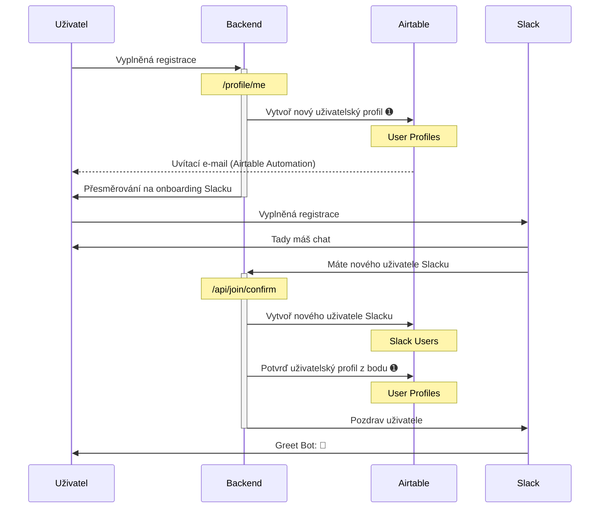

# Hacking

> [!TIP]
> Pokud si tenhle soubor prohlížíte na GitHubu, někde kolem je tlačítko, které zobrazí osnovu dokumentu.

## Instalace

Pokud chcete s webem něco dělat, je potřeba si zejména naklonovat repository a nainstalovat závislosti:

```bash
$ git clone git@github.com:cesko-digital/web.git cesko.digital
$ cd cesko.digital
$ npm ci
$ npm run dev
```

K běhu ale budete potřebovat řadu secrets, například pro připojení do databáze, viz níže. Zatím nevíme, jak s tím nejlíp naložit – pokud si to chcete vyzkoušet, ozvěte se v našem Slacku.

## Secrets

Při lokálním vývoji patří do souboru `.env.local`, web i různé nástroje kolem si je odsud načtou automaticky.

| Název klíče | Popis | Kde se používá |
| ----------- | ----- | -------------- |
| AIRTABLE_API_KEY | Klíč do databáze, čtení i zápis | Prakticky všude
| ECOMAIL_API_KEY | Klíč od Ecomailu, nástroje pro hromadný mailing | Používáme pro správu newsletterů v uživatelském profilu a pro endpoint pro zájemce o newsletter
| SLACK_CLIENT_ID, SLACK_CLIENT_SECRET | Používá se pro přihlašování k webu slackovým účtem | Pouze v nastavení autentizační knihovny NextAuth
| NEXTAUTH_SECRET | Unikátní klíč, který zabezpečuje přihlašování | V kódu AFAIK nikde není, ale automaticky ho načítá knihovna NextAuth
| SLACK_SIGNING_SECRET | Tajemství používané pro autentizaci callbacků od serverů Slacku | Používáme v endpointech pro potvrzení nových účtů
| SLACK_SYNC_TOKEN | Autentizace přístupu k API Slacku | Používáme všude možně jako „univerzální“ API klíč
| SLACK_GREET_BOT_TOKEN | API klíč Slacku | Používáme pro agendu spojenou s Greetbotem – zejména uvítání nových uživatelů
| SLACK_BAZAAR_BOT_TOKEN | API klíč Slacku | Používáme pro přístup ke Slacku v rámci automatizace služby Market-place
| SLACK_BAZAAR_CALLBACK_SECRET | Tajemství pro autentizaci callbacků od Slacku | Používáme při zpracování dialogů slackbota pro službu Market-place
| YOUTUBE_API_KEY | API klíč pro YouTube | Používáme pro načítání seznamu videí z našich playlistů, například na stránkách projektů
| PLAUSIBLE_API_KEY | API klíč pro službu Plausible, kterou používáme pro webovou analytiku | Používá se zejména pro statistické endpointy, které generují statistiky pro grafy v Datawrapperu
| SENDGRID_API_KEY | API klíč pro Sendgrid (rozesílání mailů) | Používáme pro rozesílání notifikací na nové hledané role
| SHASUM_SECRET | Náhodný klíč používaný interně pro autentizaci | Používáme například pro autentizaci odhlašovacích odkazů z notifikačních e-mailů
| TEST_SIGN_IN_PASSWORD | Náhodný klíč pro přihlášení k testovacímu účtu | Používáme při lokálním vývoji pro snazší přihlášení (podrobněji viz níže)

## Code Style, architektura, testy

Pár postřehů pro jednodušší orientaci a spolupráci:

* Kód a commity jsou anglicky, pull requesty a všechno další česky
* Používáme automatické formátování přes [Prettier](https://prettier.io), doporučujeme správně nastavit VS Code
* Používáme [ESLint](https://eslint.org), doporučujeme správně nastavit VS Code a zkontrolovat přes `npm run lint` před pushnutím

Poznámky k architektuře:

* Nebojte se psát delší soubory. Mít každou drobnost v samostatném souboru je čistě režie navíc. Lze i zobecnit – míra „procesů“ (abstrakce, dělení do souborů, dělení do funkcí, …) musí odpovídat velikosti řešeného problému. Pokud zakládáte nový soubor kvůli čtyřem řádkům kódu, je slušná šance, že děláte něco špatně.
* Dvakrát se zamyslete, než přidáte novou závislost. Třikrát, pokud má sama nějaké další závislosti. Pokud jde o vyloženě větší závislost (React, GraphQL, …), domluvme se předem, jestli je to opravdu nutné. Pokud jde místo další závislosti napsat funkce o 10–20 řádcích, je to výrazně lepší. Velký počet závislostí zpomaluje build a celkově zhoršuje ergonomii práce na projektu.

Pokud jde o testy, máme k dispozici následující hierarchii:

1. Typový systém (`npm run test:types`)
2. Jednotkové (unit) testy (`npm run test`)
3. End-to-end (E2E) testy (`npm run test:e2e`)

Čím vyšší číslo v téhle hierarchii test má, tím déle trvá a je potenciálně křehčí (snáz se rozbije). Snažte se proto pohybovat co nejníže – pokud jde pro něco napsat unit test namísto E2E testu, je to lepší. A pokud jde danou invariantu vystihnout přímo v typovém systému, je to úplně nejlepší.

# Uživatelské účty

Základní data o uživatelích máme rozdělená do dvou propojených tabulek: Tabulka _User Profiles_ obsahuje data přímo spravovaná uživatelem (například seznam jeho kompetencí), tabulka _Slack Users_ obsahuje data získaná ze Slacku (například profilový obrázek).

## Založení účtu

1. Uživatel vyplní onboardovací formulář na adrese join.cesko.digital, kde zadá základní údaje, zejména e-mail. Po odeslání uložíme do tabulky _User Profiles_ nový uživatelský profil ve stavu `unconfirmed`. (TBD: Co když už daný e-mail v databázi je?)
2. Po odeslání formuláře je uživatel přesměrován na onboarding Slacku, kde mimo jiné opět zadává mailovou adresu a Slack ji ověřuje.
3. Po úspěšném přihlášení do Slacku zavolá server Slacku automaticky náš API endpoint `/api/join/confirm` a předá ID nově přihlášeného uživatele. My uložíme do tabulky _Slack Users_ informaci o novém uživateli, podle jeho e-mailu najdeme odpovídající doposud nepotvrzený uživatelský profil v tabulce _User Profiles_, označíme jej za `confirmed` a provážeme ho s odpovídajícím řádkem tabulky _Slack Users_.



## E-maily

U každého uživatele vedeme v principu až tři e-mailové adresy:

- _Registrační e-mail_ vyplní uživatel v onboardovacím formuláři (join.cesko.digital).
  V databázi jde o pole `email` v tabulce `User Profiles`.
- Následně uživatel během onboardingu do Slacku vyplní druhý e-mail, říkejme mu třeba
  _slackový_. V ideálním případě je stejný jako ten předchozí, ale v reálu uživatelé běžně
  zadávají jiný (například ten, na který už mají zřízený jiný slackový účet).
  V databázi jde o pole `email` v tabulce `Slack Users`.
- Třetí email jde vyplnit v profilu Slacku, říkejme mu třeba _kontaktní_. V databázi ukládáme
  do pole `contactEmail` v tabulce `Slack Users` (které pro pohodlí zobrazujeme i v tabulce `User Profiles`).

Poznámky k využití jednotlivých adres:

- Obecně pracujeme s prvními dvěma adresami jako neveřejnými a teprve ta třetí je určená
  pro běžné zobrazení.
- Historicky jsme měli nejdřív pouze registrační e-maily ze Slacku, a právě ty jsme proto
  synchronizovali do Ecomailu, abychom členům komunity mohli rozesílat newsletter. Zhruba od
  začátku roku 2023 se už ale uživatelé přihlašují do Ecomailu sami prostřednictvím formuláře
  (viz https://cesko.digital/go/newsletters), kde můžou vyplnit libovolný e-mail.
- Pokud se uživatel přihlašuje přes Slack k našemu webu, součástí JWT tokenu, který přihlášením
  vznikne, je jeho slackový mail.
- Přímo měnit může uživatel svůj slackový mail ([viz tady](https://slack.com/help/articles/207262907-Change-your-email-address))
  a kontaktní mail (v profilu na Slacku).
- Ověřený je pouze slackový mail, náš registrační mail ani kontaktní mail ze slackového profilu
  zatím neověřujeme.
  
# Projekty

Projekty jsou základní stavební kámen, kolem kterého se všechno točí; většina práce v Česko.Digital se odehraje v rámci některého z projektů. Na webu je najdete na adrese https://app.cesko.digital/projects.

V Airtable je klíčová tabulka [Projects](https://airtable.com/appkn1DkvgVI5jpME) v databázi Web. (Pokud nemáte přístup do Airtable, řekněte si.)

## Popis projektů

V Airtable je ve sloupci `description`, které má zapnutou podporu formátování, viz [Using rich text with Airtable](https://support.airtable.com/docs/using-rich-text-with-airtable). V API se formátovaný text posílá ve formátu Markdown, viz [Using Markdown in Airtable](https://support.airtable.com/v1/docs/using-markdown-in-airtable).

Protože si v popisu projektů nevystačíme s běžným Markdownem, zpracováváme popis pomocí [Markdoc](https://markdoc.dev), který nabízí možnost přidávat vlastní tagy. Ty vypadají například takhle:

```markdown
Běžný odstavec.


Zvýrazněný odstavec.


Text pokračuje…
```

Tady je použitý vlastní tag `callout`, který je pak možné například v Reactu zobrazit samostatnou komponentou. Tím získáváme možnost používat v popisu projektů pokročilejší prvky, aniž bychom museli používat HTML, které by bylo nepraktické na údržbu, nehledě na problematickou bezpečnost.

### Podporované tagy

> [!NOTE]
> Tohle se netýká pouze popisu projektů, ale i akcí, takže by to chtělo vytáhnout bokem.

Seznam tagů, které můžete používat v popisu projektů nad rámec běžného Markdownu:

#### Callout

Něco jako „zvýrazněný boxík“, když potřebujete přitáhnout pozornost k části textu. Nemá žádné atributy, používá se takhle:

```markdown
Běžný odstavec.


Zvýrazněný _odstavec_.


Text pokračuje…
```

Všimněte si, že v těle „boxíku“ můžete normálně použít další Markdown, nemusí to být jen prostý text.

#### Image

Obrázek. Oproti standardnímu tagu v Markdownu podporujeme optimalizaci obrázků (zdroj může být libovolně velký, web si ho sám zmenší podle potřeby klienta) a dalších pár drobností. Příklad:

```markdown

```

Povinné atributy jsou `src`, `alt`, `width` a `height`; `src` je URL zdrojového obrázku (musí být uložený na `data.cesko.digital`), `alt` je textový popis obrázku a `width` + `height` jsou rozměry originálního obrázku v pixelech. Rozměry jsou povinné kvůli tomu, aby prohlížeč dopředu věděl, jak bude obrázek velký, a obsah během načítání neposkakoval (což je blbé UX). Všimněte si prosím, že rozměry jsou čísla, nikoliv řetězce – nejsou v uvozovkách.

Nepovinný je atribut `link`, do kterého můžete dát URL, na které se dá obrázkem prokliknout.

### Generované kotvy

Každý nadpis v rámci popisu projektu dostane automaticky generovanou kotvu, na kterou se můžete `#odkazovat`. Například tento nadpis:

```markdown
## Ukázkový nadpis
```

…se v HTML zobrazí takhle:

```html
<h2 id="ukazkovy-nadpis">Ukázkový nadpis</h2>
```

…takže na něj pak můžete odkazovat pomocí `#ukazkovy-nadpis`.

Správné URL, na které se dá odkazovat, můžete snadno zjistit najetím myší poslepu na konec nadpisu – objeví se znak `#`, který je odkazem na dotyčný nadpis.

## Odkazy

Každý projekt může mít hromádku relevantních odkazů například na web, do hlavního Slackového kanálu, na zdroják na GitHubu a podobně. Odkazy jsou uložené v tabulce [Project Links](https://airtable.com/appkn1DkvgVI5jpME/tblL8S0FHemH4XyeN/viwwojyHfjZfKW7Po?blocks=hide), mezi tabulkou Projects a tabulkou Project Links je vazba 1:M (projekt může mít libovolný počet odkazů).

Každý odkaz má povinný název a povinné URL, na které vede. Kromě nich vedeme ještě příznak `featured`; pokud je zaškrtnutý, stane se z odkazu hlavní modré CTA tlačítko na projektové stránce.

Aby bylo jednodušší načítat odkazy přes API i bez joinů nebo vícenásobných dotazů, jsou všechny odkazy projektu ještě uložené (automaticky) ve sloupci `serializedLinks` ve formátu JSON:

```json
[
  {
    "name": "Slackový kanál",
    "url": "https://app.slack.com/…",
    "featured": false
  },
  {
    "name": "Web projektu",
    "url": "https://www.csgov.cz",
    "featured": true
  }
]
```

Je to prasečí hack, ale je to pohodlné pro klienta :)
